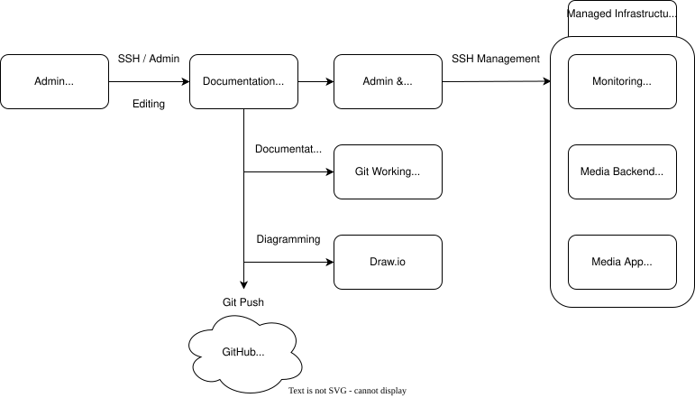

# Documentation Workflow

## Purpose

This document describes the documentation workflow used to create, edit, diagram, and publish public-safe homelab documentation.

The workflow uses a dedicated documentation host as the central point for documentation authoring, diagramming, Git operations, and administrative workflow files.

## Workflow Diagram



## Workflow Overview

The documentation workflow starts from an admin workstation and flows through a dedicated documentation host.

The documentation host is used for:

- Editing homelab documentation
- Managing Git working documents
- Creating diagrams with Draw.io
- Maintaining public-safe administrative workflow files
- Pushing sanitized documentation to the GitHub homelab repository

## Components

### Admin Workstation

The admin workstation is the primary device used to access the documentation host.

Common activities include:

- SSH access
- Documentation editing
- Diagram review
- Git workflow management

### Documentation Host

The documentation host acts as the central workspace for homelab documentation activity.

It supports:

- Git working documents
- Diagramming tools
- Administrative workflow files
- Documentation review before publishing

### Draw.io

Draw.io is used for creating structured architecture and workflow diagrams.

Diagrams intended for public documentation should be sanitized before being committed to the repository.

### Git Working Documents

Git working documents are edited locally on the documentation host before being committed and pushed to the GitHub homelab repository.

### GitHub Homelab Repository

The GitHub homelab repository stores public-safe documentation, examples, diagrams, and operational notes.

Sensitive files, internal-only configuration, private IPs, secrets, tokens, and real environment files should not be committed.

### Managed Infrastructure

Managed infrastructure represents the homelab systems administered or documented through this workflow.

Public diagrams should use role-based labels instead of real hostnames when possible.

Examples:

| Private Hostname | Public-Safe Label |
|---|---|
| `docs01` | Documentation Host |
| `mon01` | Monitoring Host |
| `mbe01` | Media Backend Host |
| `media01` | Media App Host |

## Public-Safe Documentation Rules

Before committing documentation or diagrams, check for:

- Private IP addresses
- Internal DNS records
- Real hostnames
- Secrets, tokens, or webhook URLs
- SSH private keys
- VPN details
- Firewall rules that expose internal topology
- Service ports that do not need to be public
- Unsanitized diagrams

## Pre-Commit Review

Run a basic scan before committing:

```bash
grep -RniE "10\.|192\.168|172\.16|password|token|secret|webhook|private key|BEGIN OPENSSH|docs\.lab|8081" docs/
```

Review any matches before committing. Some matches may be harmless, but they should be checked intentionally.

## Related Documents
- Draw.io Service
- Service Catalog
- Change Management
